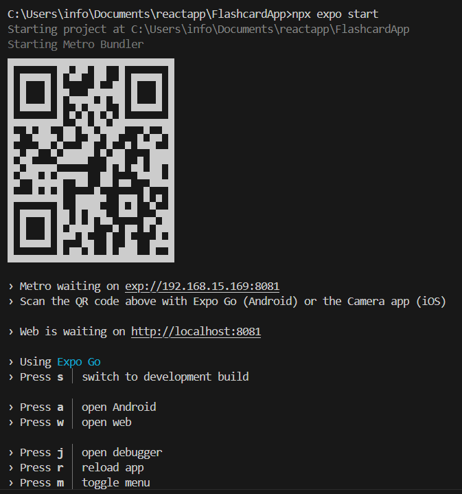
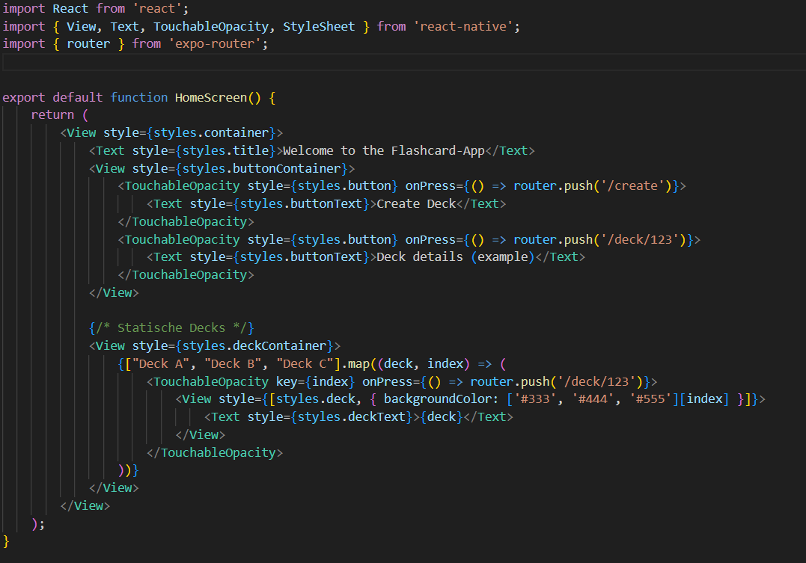

# Tagesbericht - 24.03.25

## 🔨 Was habe ich gemacht?
Am ersten Tag habe ich das Projekt aufgesetzt und die App zum Laufen gebracht.  
Nachdem ich das Repository gemacht habe und alle nötigen Packages installiert habe konnte ich anfangen mit einer kleinen Erweiterung der App.  

Danach konnte ich das Projekt erfolgreich starten und die erste Testausführung durchführen.  
()  

Nach dem erfolgreichen Setup habe ich erste Änderungen am Code vorgenommen:  
- **Index-Seite erweitert**: Ich habe eine neue Schaltfläche hinzugefügt, um einfacher zwischen den Seiten zu navigieren.  
- **Design verbessert**: Einige UI-Elemente wurden optisch überarbeitet, um die Benutzerfreundlichkeit zu erhöhen.   

Hier ein Code-Snippet:  
  

## ✅ Fazit
Mir gefällt es bis jetzt sehr gut, da wir eine Schritt-für-Schritt-Anleitung haben, nach der wir problemlos vorgehen können.  
Ich konnte die Aufträge für den ersten Tag genau in der vorgesehenen Zeit erledigen und bin zufrieden mit meiner aktuellen App.  

