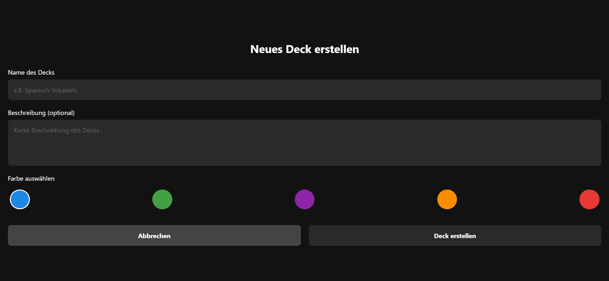

### Tagesbericht - 25.03.25

## 🔨 Was habe ich gemacht?

Heute habe ich meine Flashcard-App um einiges erweitert. Es können jetzt beliebig viele neue Decks erstellt werden.

- ✅ Deck-Erstellung mit Namen und Beschreibung

- 🎨 Farbauswahl für Decks (5 verschiedene Farben)
- 💾 Speicherung aller Daten im AsyncStorage
- 📋 Anzeige aller Decks auf der Startseite
- 🗑️ Löschfunktion für Decks

### Farbpalette

Die App verwendet eine Farbpalette mit 5 Farben für die Decks:

- 🔵 Blau: `#1E88E5`
- 🟢 Grün: `#43A047`
- 🟣 Lila: `#8E24AA`
- 🟠 Orange: `#FB8C00`
- 🔴 Rot: `#E53935`

Jedes neue Deck enthält automatisch drei Beispielkarten zu React Native-Themen.

## ✅ Fazit

Es hat mir Spass gemacht an dieser App weiter zu arbeiten und ich bin zufrieden mit dem heutigen Endergebnis.