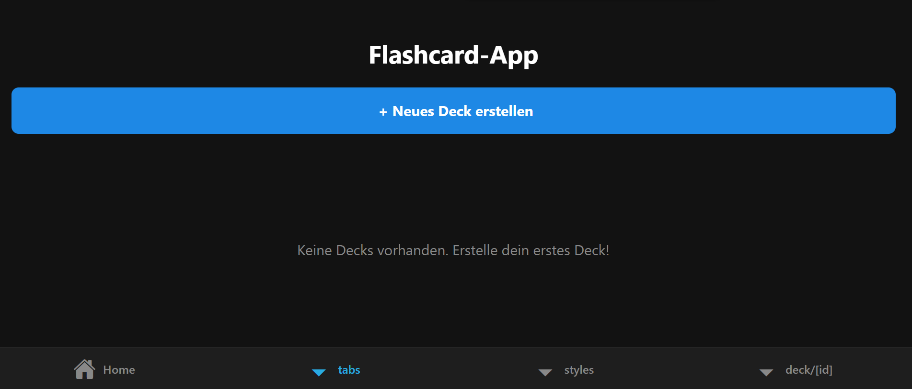

# Tagesbericht - 02.04.25

## 🔨 Was habe ich gemacht?

Heute hatte ich beim Setup der App einige Schwierigkeiten, da sie aus unbekannten Gründen nicht gerendert werden konnte. Letzte Woche hat noch alles einwandfrei funktioniert, weshalb ich etwas ratlos war. Nach mehreren Versuchen konnte ich zwar einige Aufträge erledigen, aber zum jetzigen Zeitpunkt bin ich noch nicht ganz fertig. 

Trotz der Startprobleme habe ich nach dem erfolgreichen Setup erste Änderungen am Code vorgenommen:  
- **Index-Seite erweitert**: Ich habe gemäß dem Auftrag einen Ordner „tabs“ erstellt und versucht, alles entsprechend zu implementieren.

Hier ein kleiner Zwischenstand:  

## ✅ Fazit

Heute war ich insgesamt mittelmäßig zufrieden mit mir. Einerseits konnte ich einige Fortschritte erzielen und erste Änderungen erfolgreich umsetzen. Andererseits gab es anfangs technische Probleme, die mich ausgebremst haben und zu Verzögerungen geführt haben. Ich hoffe, dass ich nächste Woche die offenen Punkte abschließen und die Probleme lösen kann.
