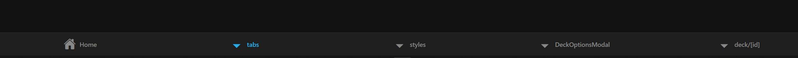

# Tagesbericht - 16.04.25

## 🔨 Was habe ich gemacht?

Heute habe ich an der Erweiterung der Stylesheets für das Flashcard-App gearbeitet. Mein Hauptfokus lag auf der Implementierung der Styles für das neue Floating-Menü (Modal) und die Farbauswahl-Komponente.
Ich habe folgende neue Style-Elemente zur styles.ts Datei hinzugefügt:

- overlay: Ein halbtransparenter Hintergrund für das Modal
- modal: Container für das Floating-Menü mit abgerundeten Ecken
- title und subtitle: Textformatierung für die Überschriften im Modal
- input: Styling für die Texteingabefelder
- colorRow: Horizontale Anordnung der Farbauswahl
- colorCircle: Runde Buttons für die Farbauswahl

Diese Styles werden in der DeckOptionsModal.tsx verwendet werden, um ein benutzerfreundliches und visuell ansprechendes Modal für die Deck-Optionen zu erstellen.
Außerdem habe ich mir die bestehende [deckId].tsx Datei angesehen, die bereits korrekt implementiert ist und dynamisch den Titel des ausgewählten Decks basierend auf der ID aus dem AsyncStorage lädt und anzeigt.
Als letztes habe ich noch den Tab unten erweitert.

Jedoch funktioniert es noch nicht ganz..