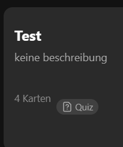
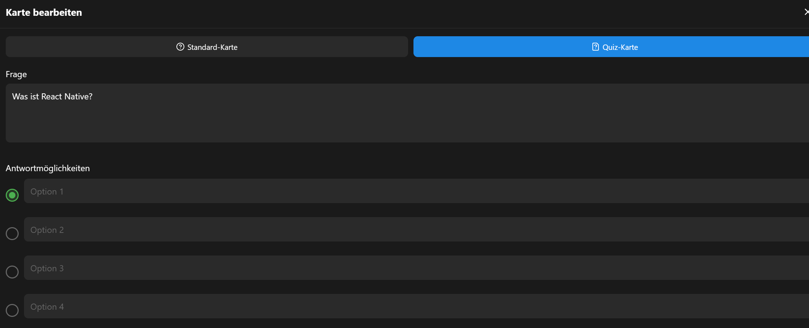

### Tagesbericht - 05.05.25

## 🔨 Was habe ich gemacht?

Heute habe ich mir vorgenommen, die Aufgabe zur Unterstützung von Cards und QuizCards im gleichen Deck zu erledigen. Ich habe die index.tsx Datei grundlegend überarbeitet, um beide Kartentypen zu unterstützen:

1. Zuerst habe ich neue Interfaces für die verschiedenen Kartentypen definiert (BaseCard, StandardCard, QuizCard)
2. Dann habe ich die Anzeige der Decks angepasst, sodass bei Decks mit QuizCards ein kleines Quiz-Badge mit Icon angezeigt wird
3. Die Kartenbearbeitung wurde erweitert, damit man zwischen den beiden Typen wählen kann
4. Für QuizCards habe ich ein Interface mit vier Antwortoptionen und der Auswahl der richtigen Antwort implementiert
5. Die Kartenanzeige wurde angepasst, um beide Typen unterschiedlich darzustellen

Besonders knifflig war die Konvertierung bestehender Karten in das neue Format, damit ältere Daten weiterhin funktionieren. Ich habe auch darauf geachtet, dass die Benutzeroberfläche intuitiv bleibt und klar zwischen den verschiedenen Kartentypen unterscheidet.

Das ganze sieht jetzt so aus, dass bei Decks mit QuizCards ein kleines Quiz-Badge angezeigt wird und man beim Erstellen einer Karte zwischen den beiden Typen wählen kann.

## ✅ Fazit

Ich konnte heute den Auftrag erledigen und bin somit zufrieden für heute. Die Implementierung funktioniert gut und unterstützt alle geforderten Funktionen. Die Benutzeroberfläche ist intuitiv gestaltet und zeigt klar an, welche Kartentypen in einem Deck enthalten sind.