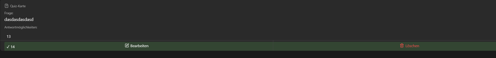

### Tagesbericht - 06.05.25

## 🔨 Was habe ich gemacht?

Heute lief mir leider nicht alles so wie geplant. Als ich am Morgen meine App starten wollte, kam folgende meldung
Sie besagte, dass die Version der Expo Go nicht mehr die neuste ist und ich von Version 52 auf 53 wechseln muss. Das Problem ist jetzt jedoch, dass das die Version 53 viele Packages von meinem Projekt nicht unterstützt. Somit ging einiges an Zeit verloren weswegen ich nicht weiterkam, später hat mir Reto geholfen und das Problem wurde endlich behoben. Später konnte ich dann doch noch ein kleines Feature implementieren jedoch sieht es noch nicht so aus wie ich es will.

## ✅ Fazit

Der heutige Tag war nicht so toll, da ich Probleme mit der Expo Go App hatte. Allerdings lief es am Nachmittag besser und ich konnte wieder arbeiten. Ich hoffe das ich das Feature in den nächsten Tagen verbessern kann.